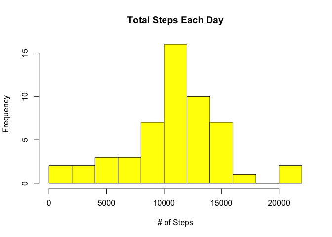
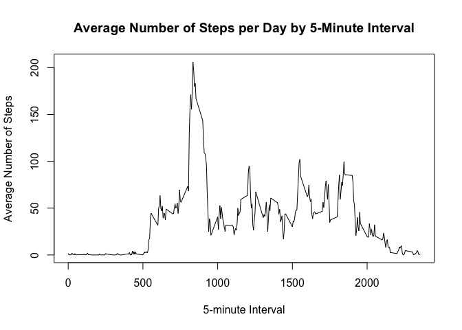
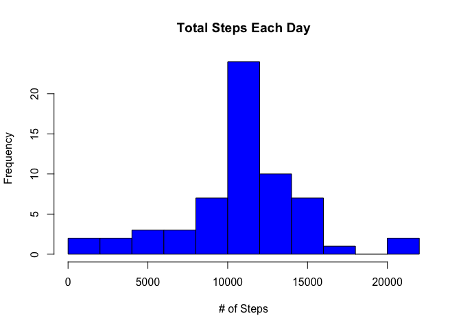
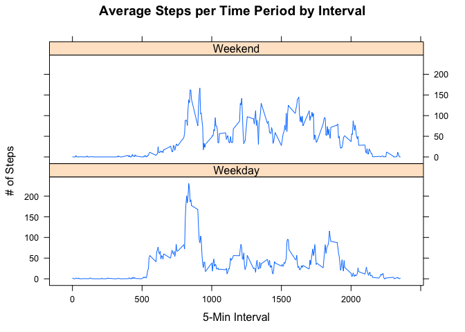

# Reproducible Research: Peer Assessment 1


## Loading and preprocessing the data
Download, unzip, and load data into data frame named "fitbit".


```r
if(!file.exists("getdata-projectfiles-UCI HAR Dataset.zip")) {
  temp <- tempfile()
  download.file(
    "http://d396qusza40orc.cloudfront.net/repdata%2Fdata%2Factivity.zip", 
                temp, method = "curl")
  unzip(temp)
  unlink(temp)
  }

fitbit <- read.csv("activity.csv")
```


## What is mean total number of steps taken per day?
1.  Calculate total steps by day 
2.  Create Histogram
3.  Calculate and report the mean and median of total steps by day


```r
steps.day <- aggregate(steps ~ date, fitbit, sum)
hist(steps.day$steps, main = paste("Total Steps Each Day"), col = "yellow", 
     xlab = "# of Steps", breaks = 10)
```

 

```r
mean.steps <- mean(steps.day$steps)
median.steps <- median(steps.day$steps)
```

-  The mean is 1.0766189\times 10^{4} and the median is 10765.


## What is the average daily activity pattern?
1.  Make a time series plot (i.e. ```type = "l"```) of the 5-minute interval and
the average number of steps taken, averaged across all days
2.  Which 5-minute interval contains the maximum number of steps?


```r
steps.interval <- aggregate(steps ~ interval, fitbit, mean)

plot(steps.interval$interval, steps.interval$steps, type="l", 
     xlab = "5-minute Interval", ylab = "Average Number of Steps", 
     main = "Average Number of Steps per Day by 5-Minute Interval")
```

 

```r
max.interval <- steps.interval[which.max(steps.interval$steps), 1]
```

-  The 5-minute interval, on average across all the days in the data set, 
containing the maximum number of steps is 835.


## Imputing missing values
Note that there are a number of days/intervals where there are missing values 
(coded as ```NA```). The presence of missing days may introduce bias into some 
calculations or summaries of the data.

1.  Calculate and report the total number of missing values in the dataset 
(i.e. the total number of rows with `NA`s)


```r
incomplete <- sum(!complete.cases(fitbit))
```

-  The total number of rows with `NA`s were 2304.

2.  Devise a strategy for filling in all of the missing values in the dataset. 
The strategy does not need to be sophisticated. For example, you could use the 
mean/median for that day, or the mean for that 5-minute interval, etc.

3.  Create a new dataset that is equal to the original dataset but with the 
missing data filled in.


```r
fitbit.imputed <- transform(
  fitbit, 
  steps = ifelse(is.na(fitbit$steps), 
                 steps.interval$steps[match(fitbit$interval, 
                                            steps.interval$interval)], 
                 fitbit$steps))
```

4.  Make a histogram of the total number of steps taken each day and 


```r
steps.day.imputed <- aggregate(steps ~ date, fitbit.imputed, sum)
hist(steps.day.imputed$steps, main = paste("Total Steps Each Day"), col="blue", 
     xlab="# of Steps", breaks = 10)
```

 

Calculate and report the **mean** and **median** total number of steps taken per 
day. 


```r
mean.imputed <- mean(steps.day.imputed$steps)
median.imputed <- median(steps.day.imputed$steps)
```

- The imputed mean is 1.0766189\times 10^{4} and 
the imputed median is 1.0766189\times 10^{4}.

Do these values differ from the estimates from the first part of the 
assignment? 


```r
mean.difference <- mean.imputed - mean.steps
median.difference <- median.imputed - median.steps
```

- The difference in the means is 0 and 
the difference in the median is 1.1886792.

What is the impact of imputing missing data on the estimates of the 
total daily number of steps?


```r
total.difference <- sum(steps.day.imputed$steps) - sum(steps.day$steps)
```

- Imputing missing data created 8.6129509\times 10^{4} more steps than the 
original data set.


## Are there differences in activity patterns between weekdays and weekends?
1. Create a new factor variable in the dataset with two levels - "weekday" and 
"weekend" indicating whether a given date is a weekday or weekend day.

2. Make a panel plot containing a time series plot (i.e. type = "l") of the 
5-minute interval (x-axis) and the average number of steps taken, averaged 
across all weekday days or weekend days (y-axis). See the README file in the 
GitHub repository to see an example of what this plot should look like using 
simulated data.


```r
weekdays <- c("Monday", "Tuesday", "Wednesday", "Thursday", "Friday")
fitbit.imputed$dow = as.factor(ifelse(is.element(weekdays(
  as.Date(fitbit.imputed$date)), weekdays), "Weekday", "Weekend"))

steps.interval.imputed <- aggregate(steps ~ interval + dow, 
                                    fitbit.imputed, mean)

library(lattice)

xyplot(steps.interval.imputed$steps ~ 
         steps.interval.imputed$interval|steps.interval.imputed$dow, 
       main = "Average Steps per Time Period by Interval", 
       xlab = "5-Min Interval", ylab = "# of Steps", layout = c(1,2), type="l")
```

 

- There are more steps on the weekend in more intervals.

[1]: https://d396qusza40orc.cloudfront.net/repdata%2Fdata%2Factivity.zip "Activity monitoring data"
